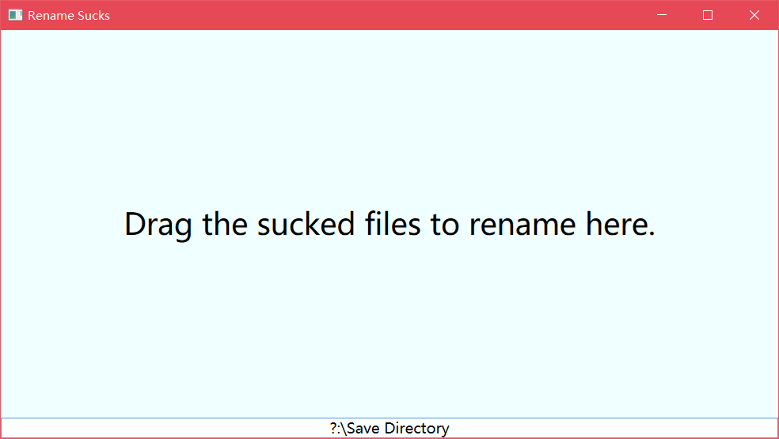

# Nam(e) sucks

Naming sucks. That's why here's this project. This WPF application can enable you to rename and organize files swiftly. The processes are simple:
- Open the app
- Enter the target directory to save at the bottom (if the path does not exist, the file would only be renamed)
- Drag the file(s) into the app
- Enter the tags of the file, seperated with spaces, and the program will automatically rename the file and move to target path

This is written only as a personal tool, but issues and pull requests are still welcome. I'm not quite good at writing C# and I managed to finish this within two hours. So, just be easy if you wanna give me any advice.

